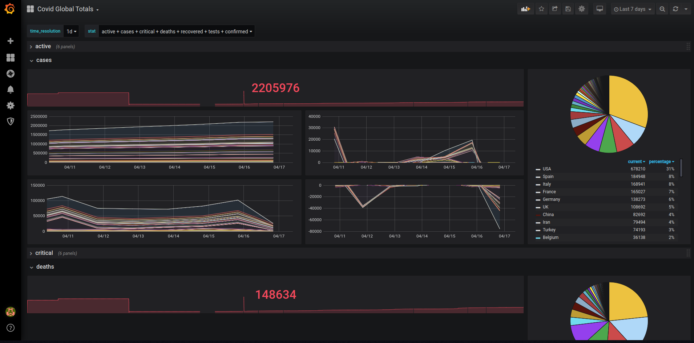
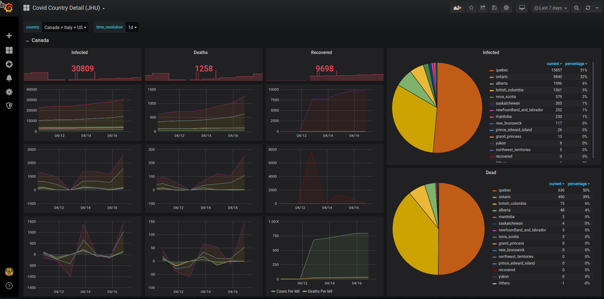

# crownwatcher
This docker getup will allows you to monitor in real time the Corona virus information on a Grafana Dashboard. To install:

- Install and upgrate docker and docker-compose
- Clone this repo onto a folder with enough space to hold a database
- Go to that folder and type sudo ./startitup.sh. This will show a bunch of logging information. You can kill/close this window when you can log into the dashborad. If you cannot, then the problem is somewhere in that window, good luck woth that....
- Point your favorite browser over to http://localhost/dashboard and login as admin/admin and change that pass
- Create a new datasource of type InfluxDB, use http://influxdb:8086 for the URL and telegraf for the database name. Click on Save and Test.

- Close your browser window
- Go to the terminal you ran the standitup.sh script on, and hit ctrl+c to stop the logging
- Run this to get the pie chart control installed in Grafana
``` bash
sudo docker exec -it dashboard grafana-cli plugins install grafana-piechart-panel
sudo docker-compose restart dashboard
```
- Log back into the dashboard http://localhost/dashboard
- Click on Import 


- Copy/paste the content of a [dashboard](grafana/dashboards) in there and click Load

On the first run, historical statistics will be imported. The imported historical data will be at a resolution of 1 day and less detailed than the live data collected whilst thing is chugging along. Here is a screenshot of Grafana while the historical data is being imported

Here is Grafana whilst the historical data is being loaded


For the first day you run this thing, there will be a data gap from the beginning of the day up to the first run. There is no "current day" historical data. For certain countries, the historical data is not broken down by region. Here is an example of the historical data turning into live data:


Here is the Global dashboard



Here is the country details dashboars
